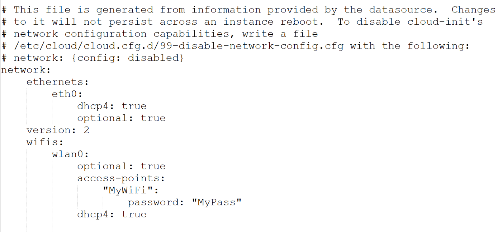

# Prepare one raspberry pi 4
* Purchase one raspberry pi 4 from RS Components Pte Ltd.
* Download [Raspberry Pi Imager ](https://www.raspberrypi.org/downloads/) into your working laopto (mine is macbook pro)
* Run Raspberry Pi Imager and choose OS ubuntu 20.04 64 bit and write into your SD card (at least 16GB)
* Insert the SD card into Raspberry Pi and boot up.
* default username and password is "ubuntu/ubuntu".
* find out your WiFi card name "ls /sys/class/net" and usually it's "wlan0".
* edit "/etc/netplan/50-cloud-init.yaml" as below

* reboot and you could remote ssh into your Raspberry Pi 4.
* sudo apt update && sudo apt upgrade -y
